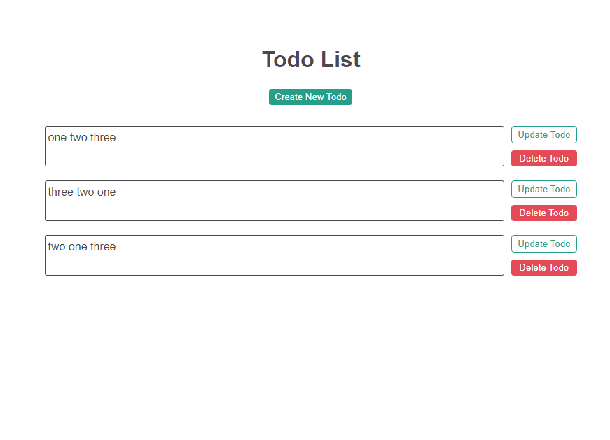

# FULLSTACK-TODO

Todo list test task.
App should have 2 pages: one for displaying all todos, and one for creating/updating todo items.
First page must have buttons for create/update redirection, and also buttons that allows user to delete todos. Second page must have a cancel button.
Tech stack should be: frontend - Nuxt, backend - Express and database should be MongoDb.



## Technology Stack

Main technologies of the project:

- [TypeScript](https://github.com/microsoft/TypeScript) - main language of the project
- [Nuxt](https://github.com/nuxt) - SSR framework (v3)
- [Express](https://github.com/expressjs/express) - server
- [Zod](https://github.com/colinhacks/zod) - type validation
- [Docker](https://www.docker.com/) - virtualization tool
- [Mongoose](https://github.com/Automattic/mongoose) - data modeling library for mongodb

## Install / Local Set Up

### With Docker

Make sure you have `docker compose` installed on your machine.

##### Create/run containers:

```sh
docker compose up --build
```

##### Stop containers:

```sh
docker compose down -v
```

Skip `-v` flag if you want docker volumes to be persistent.

### Without docker

The server setup depends on mongodb, make sure to have it running.
Go to `server` folder and create `.env` file for environment variables. Place your `MONGODB_URI` and `PORT` variables there.
Example can be found at `server/.env.example`. After you have placed correct environment variables run:

```sh
npm install
npm run dev
```

To start a client: go to `client` folder, create `.env` file and place server address there.
Example can be found at `client/.env.example`.
Then:

```sh
npm install
npm run dev
```
